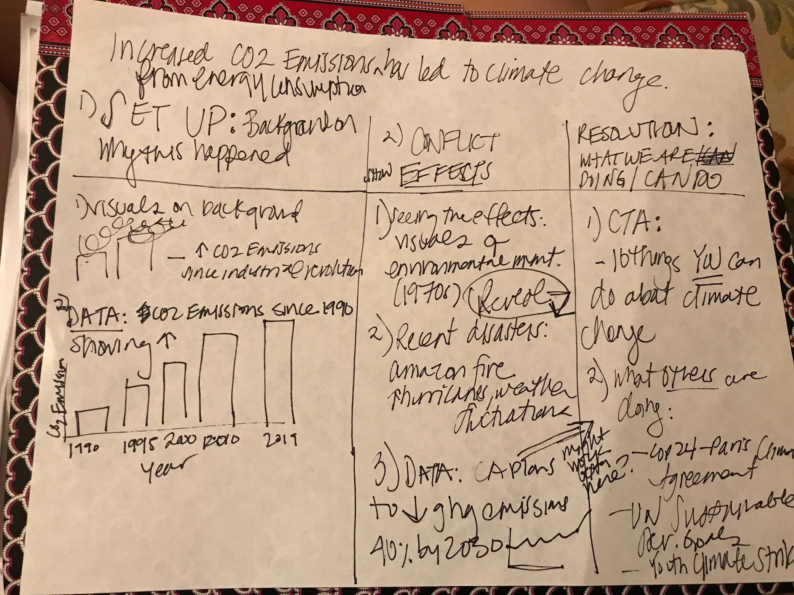

# Final Project - Part One

My final project will visualize the effects of climate change on our planet, and point to its cause: the "greenhouse effect." 

## Outline

Specifically, my story will show how increased carbob dioxide (CO2) emissions from energy consumption have led to climate change. The major elements of my story will be the:

1. Set-Up
  a. The story will open with the start of the long-lived forcing of climate change–how humans have increased atmospheric carbon dioxide   (CO2) concentration more than one third since the Industrial Revolution. 
  b. I'll show how energy consumption from 1990 to present day has increased CO2 emissions through a bar chart.
  
2. Conflict
  a. In this section, we'll discuss and show the effects of climate change on our planet. This will highlight dynamic visuals of the need for the environmental movement.
  b. I'll next reveal the grave impact of climate change by showing visuals of the fires in the Amazon and increased natural disasters, such as hurricanes.
 
3. Resolution
  a. Yet, it's not all grim. I'll then go into what people are doing to combat climate change, such as the Paris Climate Agreement and the youth climate strikes. Data on CA's plans to decrease greenhouse gas emissions 40% by 2030 will support this.
  b. I'll conclude with a call to action that asks the audience to do something about global warming.

## Initial Sketches

## The Data 

I plan to incorporate data from the U.S. Energy Information Administration, specifically data from the [U.S. Energy-Related Carbon Dioxide Emissions, 2017 report](https://www.eia.gov/environment/emissions/carbon/). The data analyzes emissions from 1990 - 2017, which I plan to visualize through a bar chart. I'll also create a line graph based on data from energy-related CO2 emissions by end-use sectors including transportation, residential, industrial and commercial. 

In addition, i'll utilize a line graph of data from [California's plan to reduce greenhouse gas emissions 40% by 2030](https://www.eia.gov/todayinenergy/detail.php?id=34792). In addition to data sets like these, I plan to cite these articles that point to the causes and impacts of climate change:

* [The Causes of Climate Change](https://climate.nasa.gov/causes/)
* [The Environmental Movement](https://www.encyclopedia.com/earth-and-environment/ecology-and-environmentalism/environmental-studies/environmental-movement)
* [10 things you can do about climate change](https://davidsuzuki.org/what-you-can-do/top-10-ways-can-stop-climate-change/)

## Method and Medium

Now that I have my data, outline and sketches, I'll create the wireframes, storyboard and moodboards. During this step, i'll write my copy about the narrative and the call to action. Next, i'll source dynamic photography of energy sources that release CO2 emissions, and photos of people taking action during the Environmental Movement all the way up through present day with the recent climate strikes. These visuals will accompany the text.

I'll then conduct user research and incorporate user feedback into my project. I can now begin to build the data visualizations using RAWGraphs, Tableu and Infogram. Afterwards, I'll start to lay out the text, images and graphics on Shorthand. Finally, I'll present my project to the class in the form of a 60-second lightning talk. 
